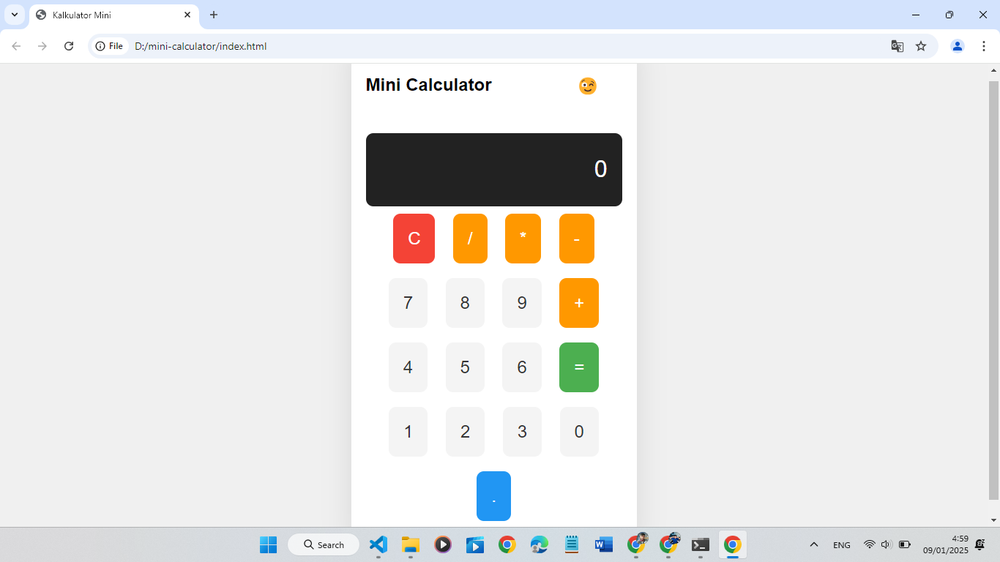

# Mini Calculator

Mini Calculator adalah aplikasi kalkulator sederhana berbasis web yang mendukung operasi aritmatika dasar seperti penjumlahan, pengurangan, perkalian, dan pembagian.

---

## 📋 Fitur

- **Operasi Dasar**: Penjumlahan, pengurangan, perkalian, dan pembagian.  
- **Antarmuka Sederhana**: Desain intuitif, mudah digunakan.  
- **Responsif**: Tampilan menyesuaikan berbagai ukuran layar.

---

## 🚀 Instalasi

1. **Kloning repositori**:  
   ```bash
   git clone https://github.com/newrizkhategar/mini-calculator.git
   ```
2. **Pindah ke direktori proyek**:  
   ```bash
   cd mini-calculator
   ```
3. **Jalankan di peramban**:  
   Buka file `index.html` untuk memulai aplikasi.

---

## 📖 Cara Penggunaan

1. Masukkan angka menggunakan tombol yang disediakan.  
2. Pilih operasi yang ingin dilakukan (**+**, **-**, **×/***, **÷**).  
3. Tekan tombol `=` untuk melihat hasil perhitungan.  
4. Gunakan tombol `C` untuk menghapus input dan memulai perhitungan baru.

---

## 📂 Struktur Proyek

```plaintext
mini-calculator/
├── index.html    # File utama untuk tampilan antarmuka
├── styles.css    # File CSS untuk styling
└── script.js     # File JavaScript untuk logika kalkulator
```
